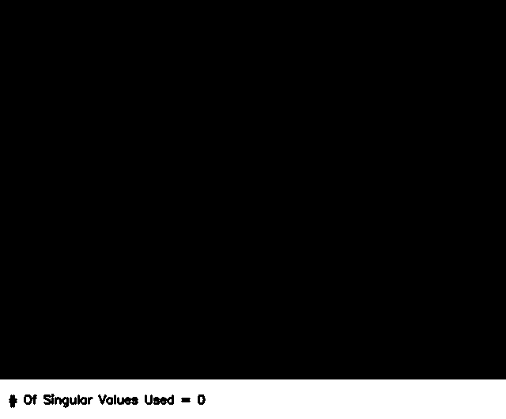
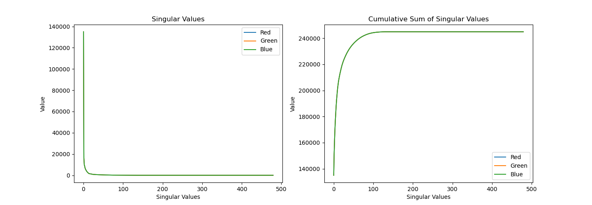

# Image Compression Using SVD

## Intuition

 

An image is a matrix. Yes, in reality RGB images are stacked, 3D matrices, but for the sake of interpretation just think of an image as a matrix. This matrix can be represented by $\bm{X}$. We can also perform an SVD on $\bm{X}$ to get $\bm{X} = \bm{U\Sigma V^T}$.

In `image_compression.py`, you can observe that the reconstructed image (let us call it $\bm{\tilde{X}}$ ) is formed from $k$ columns of these matrices. The compressed image is therefore a rank $k$ approximation of the original image where $\bm{\tilde{X}} = \bm{U_k\Sigma_kV_k^T}$.

But why does the approximated image still look good without using all singular values/modes? 

We might guess that perhaps not all modes/columns of the SVD matrices contributes that much to the key features in an image. One way to check if this interpretation is true is by plotting the singular values and cumulative singular values of the image.

 

As we suspected, the first few singular values have really high values/energy. In fact, we can see that just as we qualitatively observed, around the $rank=k=70$ mark and beyond, the singular values are incredibly small. It isn’t that they are not useful. These large singular values might be essential for some incredibly fine or detailed aspects of the image but if we don’t want such fine detail, the compression results using SVD are incredibly satisfactory. Depending on the complexity of the image the number of modes required for a good approximation may vary. Simpler images require even fewer modes during reconstruction while more complicated images require more modes during reconstruction.

## Instructions

Ensure you have the following libraries to run this program:
- cv2
- numpy
- imageio
- matplotlib
- pathlib
- tqdm